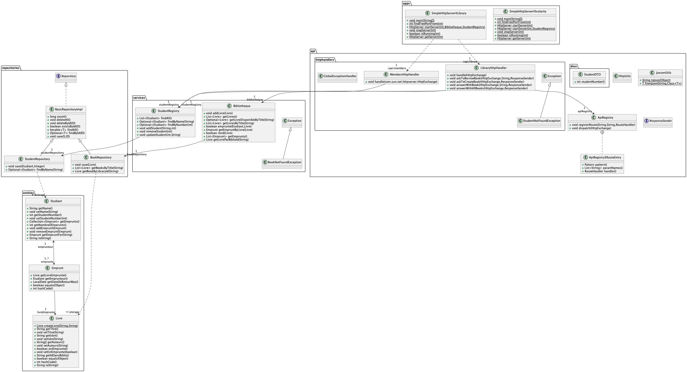

# Documentation

Dans cette démonstration, nous avons placé dans ce répertoire,
- le source puml pour générer un diagramme de classes
- le source puml pour générer un diagramme de séquence
et les images générées.

La figure suivante illustre les couches plus ou moins les couches de l'application.
PlantUML est utilisé pour générer les diagrammes et n'est pas vraiment adapté pour faire des modélisations "contrôlées".

