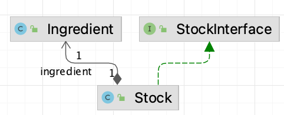
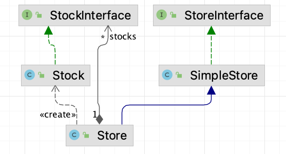
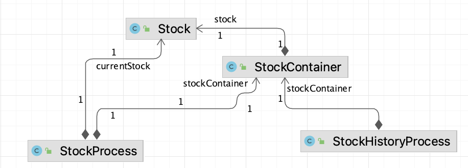
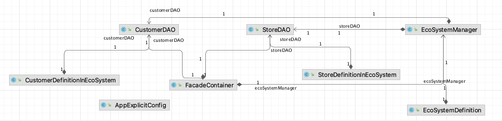
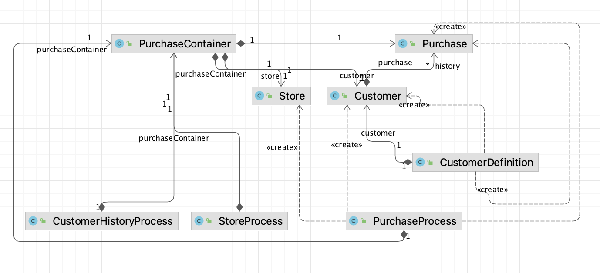

# From features to tests

----
:warning: This set of examples is intended to demonstrate specific concepts such as the use of Gherkin, setting up mocks, and managing containers. Please note that these examples should not be taken as a blueprint for architecture but are rather meant to illustrate ideas and approaches in isolation.  
Furthermore, some concepts may be defined multiple times under different names within these examples, which should not be considered a recommended practice in a real project.  
Students are encouraged to adapt these examples to their own needs and to seek appropriate approaches based on the specific requirements of their projects.

:warning: **Warning: Do not consider these examples as a model architecture.**

--------

## Under _stocks_: very simple version
**Features** : _GestionDuStock.features_ (in French) and _StockManagment_.features (in English) provide a very basic view of stock management through Cucumber-defined tests.  
**Implementations** :The steps are implemented in _GestionDuStockDefinitions_ (in French) and _StockDefinitions_ under _stocks_

## Under _stores_: simple version integrating Gherkin structure : _Examples_ 
**Features** : _ManageStore.feature_ provides examples of tests that include scenarios with _Examples_.   
**Implementations** :The associated steps are defined in _StoreDefinitions.java_.  

## Under _withHistory_: first use of dependency injection (no picocontainer). 
We want to verify the stock history but do not want to define the history tests in the same file as the stock tests.

**Features**: _StockWithHistory.feature_ defines simple tests that verify stock actions and history.  

**Implementations** : The steps are defined in both _StockProcess.java_ and _StockHistoryProcess.java_.

## Under _centralsystem_: use of explicit containers and dependency injection
We employ a "facade" to streamline purchase management 
by managing interactions between the purchasing store and the customer through a central system. 
We use DAOs (Data Access Objects) to represent data that could reside in databases, such as customer and store information. 
Dependency injection is employed to establish connections between these classes.

**Features**: The purchasing-related tests are defined in _PurchasingEcosystem.features_, covering interactions between customers, stores, and the central system.

**Implementations**: The steps are defined in the following files:
- _CustomerDefinitionInEcoSystem.java_, which references _CustomerDAO.java_ and _FacadeContainer.java_.
- _StoreDefinitionInEcoSystem.java_, which references _StoreDAO.java_ and _FacadeContainer.java_.
- _EcoSystemDefinition.java_, which refers to _EcoSystemManager.java_ and _FacadeContainer.java_.

_FacadeContainer.java_ serves as a container holding the central system, customer relations, and store interactions. 
It is instantiated by the environment and utilized by the steps. 
An explicit configuration (_AppExplicitConfig_) is employed for injection via constructors.

### Test Classes and Dependency Injection (Constructor and Field Injection)

We have defined test classes that do not rely on Cucumber and explicitly illustrate the use of containers.

- **CustomerManagerTest.java**: The **CustomerManager** class utilizes Constructor Injection, obtaining its dependencies through its constructor, specifically from the _CustomerDAO_.

- **StoreManagerTest.java**: The **StoreManager** class employs Field Injection, acquiring its dependencies using the `@Inject` annotation, specifically from the _StoreDAO_.

<!-- ## Under _purchasing_: separation of concerns 

Our objective is to demonstrate how concerns can be managed separately 
by organizing them into different test classes and utilizing a shared object, _PurchaseContainer_.

**Features**:
-  _PurchasingManagment_.feature_ defines tests related to customer management.

**Implementations**:
- _CustomerDefinition_ provides the implementation for the simple steps defined in _CustomerManagement.feature_.

**Features**:
- _PurchasingManagement.feature_ defines tests related to purchasing.

**Implementations**:
- _PurchaseContainer_ contains the customer, the store, and the purchase itself.
- _PurchaseProcess.java_ uses the _PurchaseContainer_ to manage the purchase.
- _CustomerHistoryProcess_ uses the _PurchaseContainer_ to handle customer purchase history.
- _StoreProcess_ uses the _PurchaseContainer_ to manage store-related processes.

-->

## Under _payment_: MOCKITO and Dependency Injection
Under _test_ part of _payment_, we use of a container, dependency injection and integration tests  to simulate an external payment service.
